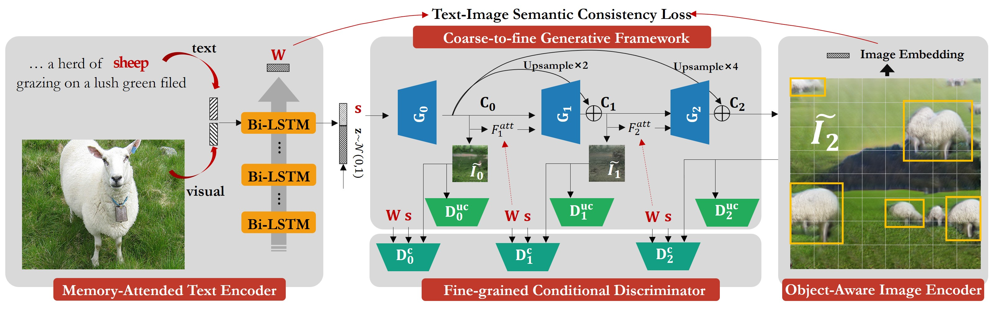
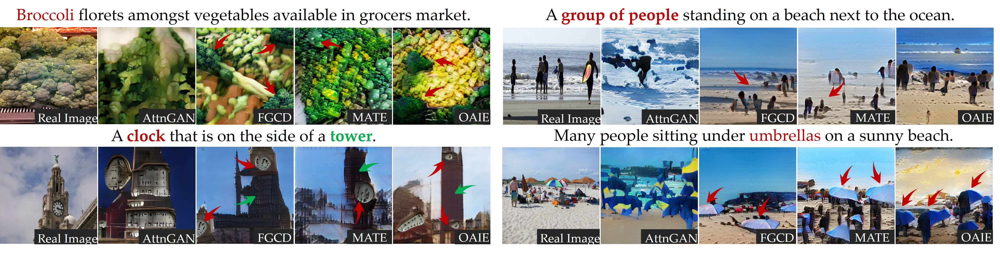
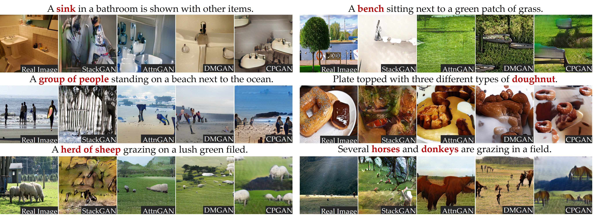

# CPGAN
The method of text-to-image
Pytorch implementation for reproducing CPGAN results in the paper CPGAN: Full-Spectrum Content-Parsing Generative Adversarial Networks for Text-to-image Synthesis by Jiadong Liang, Wenjie Pei, Feng Lu.



## Getting Started
### Installation

- Create  anaconda virtual environment

```bash
conda create -n CPGAN python=2.7
```

- Install PyTorch and dependencies from http://pytorch.org

```bash
conda install pytorch=1.0.1 torchvision==0.2.1 cudatoolkit=10.0.130
```
- PIP Install

```bash
pip install python-dateutil easydict pandas torchfile nltk scikit-image h5py pyyaml
```

- Clone this repo:

```bash
https://github.com/dongdongdong666/CPGAN.git
```
- Download train2014-text.zip from [here](https://drive.google.com/file/d/1UBgUHYWSmDD1Gnja2K7ZCVuQTLR89PAf/view?usp=sharing) and unzip it to data/coco/text/.

- Download memory features for each word from [here](https://drive.google.com/file/d/145fBRWbqTdQUFFtoOwGhA9TW_ZVLeZVx/view?usp=sharing) and put the feature to memory/.

- Download Inception Enocder [here](https://drive.google.com/file/d/1i3TW5mOsXaqZqzfSeHIBzuxb6CL4BjvO/view?usp=sharing) , Generator [here](https://drive.google.com/file/d/1nirpy1jI5_sh_b_Mnbw-I3SSI7K-5UE_/view?usp=sharing) , Text Encoder [here](https://drive.google.com/file/d/1JO7NQM4JOHRoABxUqMYEQPDvs_w2lTJ8/view?usp=sharing) and put these models to models/.

### Test

**Sampling**
- Set `B_VALIDATION：False` in "/code/cfg/eval_coco.yml".
- Run `python eval.py --cfg cfg/eval_coco.yml --gpu 0` to generate examples from captions listed in "data/coco/example_captions.txt".  Results are saved to "outputs/Inference_Images/example_captions". 

**Validation**
- Set `B_VALIDATION：True` in "/code/cfg/eval_coco.yml".
- Run `python eval.py --cfg cfg/eval_coco.yml --gpu 0` to generate examples for all captions in the validation dataset. Results are saved to "outputs/Inference_Images/single". 
- Compute inception score for the model trained on coco.  
```bash
python caculate_IS.py --dir ../outputs/Inference_Images/single/
```
- Compute R precison for the model trained on coco.  
```bash
python caculate_R_precison.py --cfg cfg/coco.yml --gpu 0 --valid_dir ../outputs/Inference_Images/single/
```
### Train

TBA

### Examples generated by CPGAN

- Qualitative comparison between different modules of our model for ablation study, the results of AttnGAN are also provided for
reference.



- Qualitative comparison between our CPGAN with other classical models for text-to-image synthesis.



### Performance

Note that after cleaning and refactoring the code of the paper, the results are slightly different. We use the Pytorch implementation to measure inception score and R precision.

|Model |R-precision↑  |IS↑  |
|----|-----| -----|
| Reed | (-)| 7.88 ± 0.07|
| StackGAN | (-)| 8.45 ± 0.03|
| Infer| (-) | 11.46 ± 0.09|
| SD-GAN | (-)| 35.69 ± 0.50 | 
| MirrorGAN | (-)| 26.47 ± 0.41 |
| SEGAN| (-)| 27.86 ± 0.31|
| DMGAN| 88.56%| 30.49 ± 0.57|
| AttnGAN| 82.98%| 25.89 ± 0.47|
| objGAN| 91.05%| 30.29 ± 0.33|
| CPGAN| 93.59%| 52.73 ± 0.61|

